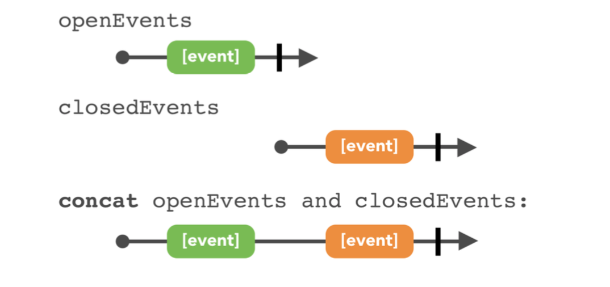

# Combining Operators in Practice

+++

### fetch Event from NASA's open API

1. network sevice layer


---

2. Model and error handling

```swift
static var categories: Observable<[EOCategory]> = {
    return EONET.request(endpoint: categoriesEndpoint)
      .map { data in
        let categories = data["categories"] as? [[String: Any]] ?? []
        return categories
          .flatMap(EOCategory.init) // input $0 in to EOCategory
          .sorted { $0.name < $1.name } // sort it
      }
      .catchErrorJustReturn([]) //error just return empty array
      .share(replay: 1, scope: .forever) //cache forever
  }()
```

+++

```swift
let eoCategories = EONET.categories // when you want to fetch the EOCategory info
// CategoriesViewController is the main page
let categories = Variable<[EOCategory]>([])
let eoCategories = EONET.categories 
eoCategories
  .bind(to: categories) // you can bind the observables to subjects making them as a subscribers 
  .disposed(by: disposeBag)
//subscribe to the Variable to update the table view
categories
  .asObservable()
  .subscribe(onNext: { [weak self] _ in
    DispatchQueue.main.async {
      self?.tableView?.reloadData()
    }
    //observeOn(_:) operator in Chapter 15, “Intro to Schedulers/Threading in Practice”.
  })
  .disposed(by: disposeBag)
```

+++

**concat events**



what if one of them errors out??

If either of those errors out, it immediately relays the error and terminates. 

---

**improvement**

```swift
static func events(forLast days: Int = 360, category: EOCategory) -> Observable<[EOEvent]> {
    let openEvents = ...
    let closedEvents = ... 
    return Observable.of(openEvents, closedEvents)
      .merge() // using merge and reduce to an array of EOEvents
      .reduce([]) { running, new in
        running + new
    }
}
```

---
filter out the events
```swift
//Events view controller
let events = Variable<[EOEvent]>([])
let disposeBag = DisposeBag() 
```

```swift
Observable.combineLatest(days.asObservable(), events.asObservable()) { (days, events) -> [EOEvent] in
      let maxInterval = TimeInterval(days * 24 * 3600)
      return events.filter { event in
        if let date = event.closeDate {
          return abs(date.timeIntervalSinceNow) < maxInterval
        }
        return true
      }
    }
// The closure filters out events, keeping only those in the requested days range
    .bind(to: filteredEvents)
    .disposed(by: disposeBag)
```

Bind slider value to days(variable)

---

#### Getting events for categories 

**Split category downloads**

```swift
let downloadedEvents = eoCategories.flatMap { categories in
      return Observable.from(categories.map { category in
        EONET.events(forLast: 360, category: category)
      })
    }
    .merge(maxConcurrent: 2) //limit the maxinum subscribe counts for EONET
```
---


```swift
let updatedCategories = eoCategories.flatMap { categories in
  downloadedEvents.scan(categories) { updated, events in
    return updated.map { category in
      let eventsForCategory = EONET.filteredEvents(events: events,
forCategory: category)
      if !eventsForCategory.isEmpty {
        var cat = category
        cat.events = cat.events + eventsForCategory
        return cat
}
      return category
    }
} }
```

+++

# Time Based Operators

+++

#### Buffering operator 

They allow you to control how and when past and new elements get delivered. 

```swift
replay(_:)
replayAll()
```

open xcdoe playground

```swift
class TimelineView<E>: TimelineViewBase, ObserverType where E: CustomStringConvertible {
  static func make() -> TimelineView<E> {
    return TimelineView(width: 400, height: 100)
  }
    //show green boxes accroding to the events it got
  public func on(_ event: Event<E>) {
    switch event {
    case .next(let value):
      add(.Next(String(describing: value)))
    case .completed:
      add(.Completed())
    case .error(_):
      add(.Error())
    }
  }
}
```

```swift
let sourceTimeline = TimelineView<Int>.make() // upper
let replayedTimeline = TimelineView<Int>.make() //lower line
```

<Demo>

```swift
replay(_:)
replayAll() // using replayAll() on a sequence that may not terminate and may produce a lot of data will quickly clog your memory.
multicast(_:)
publish()
```

Controlled buffering 

```swift
sourceObservable
  .buffer(timeSpan: bufferTimeSpan, count: bufferMaxCount, scheduler: MainScheduler.instance)
  .map { $0.count } //顯示收到的signal 數量
  .subscribe(bufferedTimeline)
```


```swift
let elementsPerSecond = 0.7
let timer = DispatchSource.timer(interval: 1.0 / Double(elementsPerSecond), queue: .main) {
  sourceObservable.onNext("🐱") // 每0.7秒送貓
}
```

<Demo>

#### Windows of buffered observables 

---


---

```
window(timeSpan:count:scheduler:) //The only difference is that it emits an Observable of the buffered items, instead of emitting an array.
```

---

```swift
_ = sourceObservable
  .window(timeSpan: windowTimeSpan, count: windowMaxCount, scheduler: MainScheduler.instance)
  .flatMap { windowedObservable -> Observable<(TimelineView<Int>, String?)> in
    let timeline = TimelineView<Int>.make() // when grouped Observables emited create a new TimelineView
    stack.insert(timeline, at: 4) // side effect 
  	stack.keep(atMost: 8) // side effect 
    return windowedObservable
      .map { value in (timeline, value) } // make every windowedObservable to a (timeline,"🐱" )
      .concat(Observable.just((timeline, nil))) //terminal
  }
  .subscribe(onNext: { tuple in
    let (timeline, value) = tuple
    if let value = value {
      timeline.add(.Next(value))
    } else {
      timeline.add(.Completed(true))
    }
  })
```

---

#### Time-shifting operators 

+++

Delay 

```swift
delaySubscription(_:scheduler:) // To delay the time a subscriber starts receiving elements from its subscription 
//Does it matter if the source is hot or cold?
//When delaying a subscription, it won't make a difference if the observable is cold. If it's hot, you may skip elements, as in this example.
```

```swift
sourceObservable.delaySubscription(RxTimeInterval(delayInSeconds), scheduler: MainScheduler.instance)
```

<Demo>

---

```swift
 delay(_:scheduler:) //
```

interval

```swift
//go back to replay example
let sourceObservable = Observable<Int>
  .interval(RxTimeInterval(1.0 / Double(elementsPerSecond)), scheduler: MainScheduler.instance) // using interval instead of DispatchSource.timer(_:queue:)
  .replayAll()
sourceObservable.dispose() //cancel the timer 
```

+++

One-shot or repeating timers 

```swift
Observable.timer(_:period:scheduler:)
```

```swift
_ = Observable<Int>
  .timer(3, scheduler: MainScheduler.instance) // get signal with a 3s delay after you suscribed (with period = 1)
  .flatMap { _ in
    sourceObservable.delaySubscription(RxTimeInterval(delayInSeconds), scheduler: MainScheduler.instance) // create a series of delay obsevables
  }
  .subscribe(delayedTimeline)
```

+++

Timeout

```swift
let _ = button
  .rx.tap
  .map { _ in "•" }
  .timeout(5, other: Observable.just("X"), scheduler: MainScheduler.instance) //onCompleted
  .subscribe(tapsTimeline)
```

<Demo>

